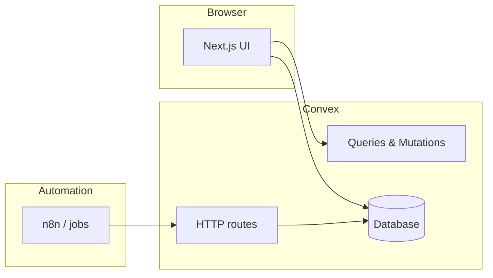

# Pigeon-eye

**Citizen reporting for Peoples** — capture a photo, place it on the map, and track urban issues with AI-assisted analysis and optional automation hooks.

**Live site (Vercel):** [https://pigeon-eye-tmvu-git-main-vspaceman11s-projects.vercel.app/](https://pigeon-eye-tmvu-git-main-vspaceman11s-projects.vercel.app/)

---

## Overview

Pigeon-eye is a **mobile-first** web app: an interactive **Leaflet** map, camera capture, structured reporting, user profiles with **points**, and a **rewards** flow backed by Convex. Heavy lifting for vision, branching, and municipality-style workflows is designed to run **outside** the browser (e.g. **n8n** calling back into Convex), while the app stays fast and real-time via **Convex** queries and mutations.

| | |
| :--- | :--- |
| **Frontend** | Next.js (App Router), React 19, Tailwind CSS, Radix / shadcn-style UI |
| **Backend** | [Convex](https://convex.dev) — schema, auth, HTTP routes, real-time data |
| **Auth** | [@convex-dev/auth](https://labs.convex.dev/auth) (JWT keys on the Convex deployment) |
| **Map** | Leaflet |
| **Automation** | n8n (or any HTTP client) → Convex HTTP endpoints with a shared secret |

---

## Features

- **Map-first home** — browse issues, open detail views, and navigate the reporting flow.
- **Photo capture** — attach evidence to a report before submit.
- **Issues pipeline** — severity (`EASY` / `MEDIUM` / `HIGH`), status, categories, AI copy, geodata, and optional escalation letter fields on each issue.
- **Convex Auth** — sign-in / sign-up flows wired through Convex.
- **Gamification** — user points and **coupons** / rewards shop.
- **HTTP API for workflows** — secured callbacks so external automation can create or update issues and push analysis or escalation payloads.

---

## Architecture (high level)



- The **Next.js** app talks to Convex only through the official client (`useQuery`, `useMutation`, `useAction` patterns).
- **n8n** (or similar) calls your deployment’s **Convex Site URL** (e.g. `https://<your-deployment>.convex.site/...`) with `Authorization: Bearer <secret>` when `WEBHOOK_SECRET` is set.

---

## Prerequisites

- **Node.js** (LTS recommended)
- **npm**
- A **Convex** project (`npx convex dev` links or creates one)

---

## Quick start

```bash
git clone <your-repo-url>
cd I3H
npm install
```

### 1. Environment (Next.js)

Create `.env.local` and point the app at Convex (either form works; the client prefers the public name in the browser):

```bash
# Required for the Convex React client
NEXT_PUBLIC_CONVEX_URL=https://<your-deployment>.convex.cloud

# Optional fallback (e.g. server-only contexts)
# CONVEX_URL=https://<your-deployment>.convex.cloud
```

### 2. Convex environment

In the [Convex dashboard](https://dashboard.convex.dev) (or via CLI), set at least:

| Variable | Purpose |
| :--- | :--- |
| **`CONVEX_SITE_URL`** | Your Convex site origin, e.g. `https://<your-deployment>.convex.site` — required for auth flows |
| **`WEBHOOK_SECRET`** | Shared secret for HTTP ingest; callers send `Authorization: Bearer <WEBHOOK_SECRET>` |

Optional (used when triggering outbound automation from Convex):

| Variable | Purpose |
| :--- | :--- |
| **`N8N_WEBHOOK_URL`** | URL Convex calls for workflow triggers |
| **`N8N_WEBHOOK_SECRET`** | Secret for those outbound requests |

### 3. Convex Auth — JWT keys

Keys must exist on the **Convex** deployment (not only in `.env.local`):

```bash
npm run auth:keys
npx convex env set --from-file .env.auth
# If variables already exist:
# npx convex env set --from-file .env.auth --force
```

Restart `npx convex dev` after changing dashboard env vars.

### 4. Run

```bash
npx convex dev
# in another terminal:
npm run dev
```

Open [http://localhost:3000](http://localhost:3000).

---

## HTTP endpoints (automation)

Base URL: **`https://<deployment>.convex.site`**

When `WEBHOOK_SECRET` is set, include:

```http
Authorization: Bearer <WEBHOOK_SECRET>
Content-Type: application/json
```

| Method & path | Role |
| :--- | :--- |
| `POST /api/issues` | Create or merge issue data from a workflow (see `convex/http.ts` for body fields). |
| `POST /api/issues/analysis` | Push vision / analysis results or record errors. |
| `POST /api/issues/escalation-letter` | Update escalation letter draft/status from automation. |

CORS is enabled for selected routes where OPTIONS is defined — prefer server-to-server calls for production.

---

## Scripts

| Command | Description |
| :--- | :--- |
| `npm run dev` | Next.js development server |
| `npm run build` | Production build |
| `npm run start` | Start production server |
| `npm run lint` | ESLint |
| `npm run auth:keys` | Generate auth key material for Convex Auth |

---

## Repository layout

```
app/                 # App Router pages (home, sign-in, sign-up)
components/          # UI, map, camera, forms, Convex provider
convex/              # Schema, auth, issues, users, coupons, HTTP router
hooks/               # Client hooks (e.g. uploads)
messages/            # de.json / en.json — copy for localization workflows
public/              # Icons and static assets
```

---

## Deployment (Vercel)

1. Connect the repo to **Vercel** and set `NEXT_PUBLIC_CONVEX_URL` (and any other public env vars).
2. Keep **secrets** (`WEBHOOK_SECRET`, API keys, auth keys) in **Convex** or Vercel **server** env — never expose them in client bundles.
3. Ensure `CONVEX_SITE_URL` in Convex matches your deployed site where users complete auth.

---

## Contributing & AI agents

Human and automated contributors: see **[AGENTS.md](./AGENTS.md)** for stack conventions, subagent roles, and Convex guidelines (`convex/_generated/ai/guidelines.md`).

---

## License

Private project (`"private": true` in `package.json`). Adjust this section if you publish the source.
